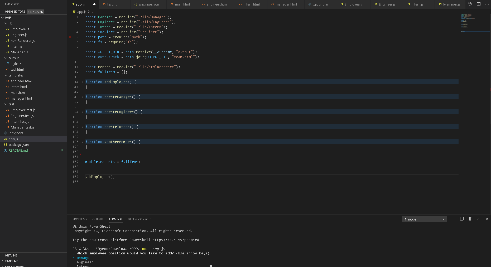

# Template Engine

A software engineering team generator command line application. 

## Installation

Use the package manager [npm](https://docs.npmjs.com/cli/install) to install npm dependencies.

```bash
npm install jest
npm install inquirer
```

## Usage

*In the terminal*
```javascript
node app.js
```
[Video of the application in use](https://drive.google.com/file/d/1EV2CT6lCVyacB9CQuXbempgDqzCOXsGJ/view) 




## License
[MIT](https://choosealicense.com/licenses/mit/)